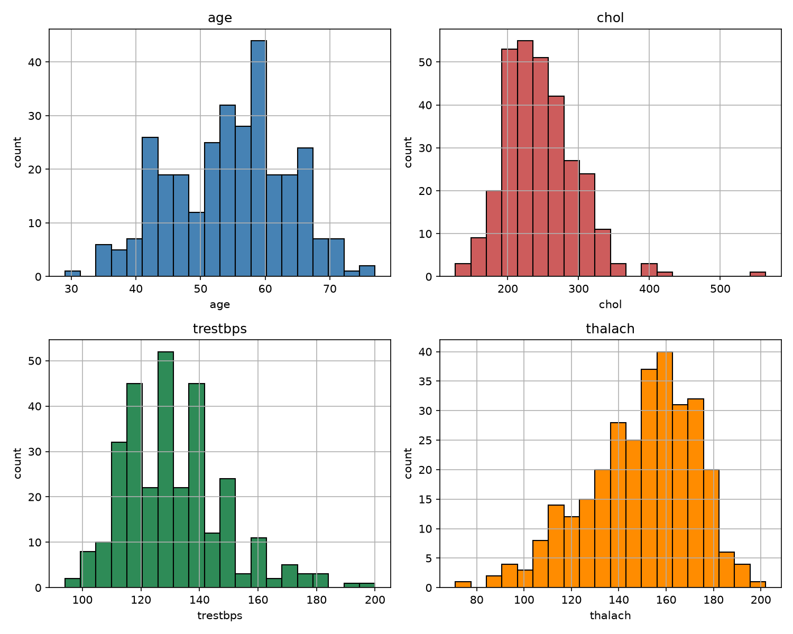
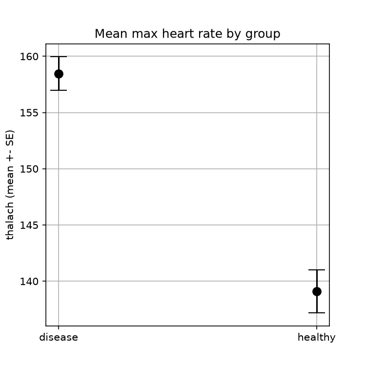
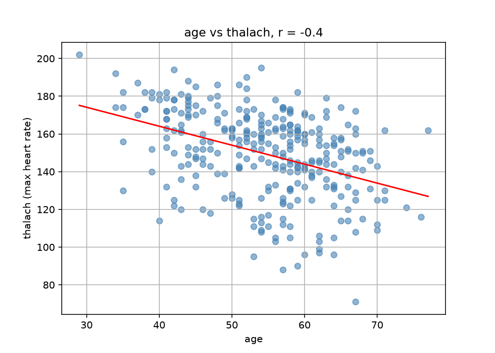
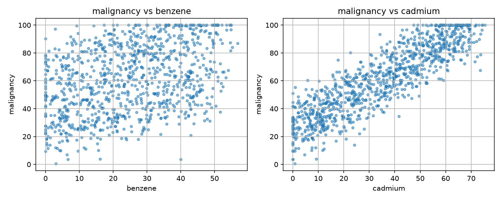
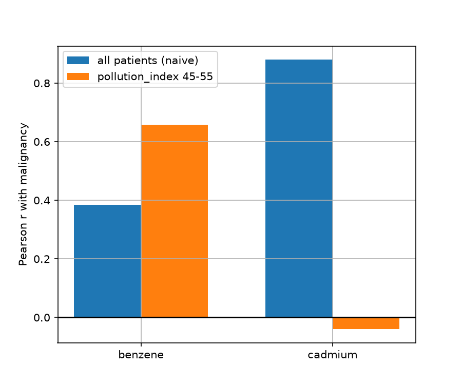

# CSPC Computer Science for Physics and Chemistry

My coursework repository. Each practical is under `PW<n>/Lab <X>/`.

## Setup

Create the environment for a given lab with `conda env create -f "PW<n>/Lab <X>/environment.yml"`, then run `conda activate cspc`.

---

## PW1 - Lab A: Reproducible Foundations

**What I built:**
- The CSPC repository with a conda environment (`environment.yml`), the decay simulation files, three pytest tests and a speed comparison script, all pushed to GitHub.

**Speed comparison (loop vs NumPy):**
- loop : 3.5814 s
- numpy : 0.0003 s
- speed-up: 13502.6 x faster

**Tests:** all passing? yes (3 passed)

**Conclusion:**
- The repository, the environment and the tests all worked. The NumPy version is thousands of times faster than the pure Python loop because it decides all atoms at once with one binomial draw instead of looping over every atom. The exact speed-up changes a little from run to run, because the NumPy time is very small.

## PW1 - Lab B

### Data Analysis & Results
The observed data (`decay_observed.csv`) represents a decay process over time. Upon plotting the side-by-side comparison, the scatter points of the observed dataset match the analytical decay law ($N(t) = N_0 e^{-\lambda t}$) with $\lambda = 0.3$.

### Automation
The Snakemake pipeline automates the generation of `figure.png` from `decay_observed.csv` via `plot.py`, re-executing only when the input dataset or script changes.

---

## PW2 - Lab A: Motion from Tracking Data

**What I did:**
- Read the noisy height measurements of a falling object (`freefall.csv`), computed velocity and acceleration with `np.gradient`, integrated the acceleration back with `cumulative_trapezoid`, and plotted position, velocity and acceleration in `motion.png`.

**Results:**
- Mean acceleration: -8.58 m/s^2 (the expected value is -9.81 m/s^2; ignoring the first and last two points gives -9.25 m/s^2)
- Standard deviation of the acceleration: 28.7 m/s^2
- Largest difference between the recovered and the original position: 0.78 m

**Why the acceleration is noisy:**
- Each derivative divides the difference between neighbouring noisy values by a small time step (0.1 s), which magnifies the measurement error, and the acceleration needs two derivatives, so it is much noisier than the position.

**What integrating back showed:**
- Even though the acceleration was very noisy, integrating it twice recovered the position to within 0.78 m, because integration is a sum and the random errors partly cancel out. Differentiation amplifies noise, integration suppresses it.

**Bonus: 2D tracked trajectory:**
- The tracked path in `trajectory.csv` has the shape of a figure eight. I computed the velocity components with `np.gradient` on x and y separately and combined them into the speed sqrt(vx^2 + vy^2); the figure is saved as `trajectory.png`.
- Max speed: 38.69, mean speed: 23.65 (position units per second). The speed rises and falls several times during the run, and the curve is a bit rough because the tracking data is noisy and the derivative amplifies that noise (only one derivative here, so much less than for the acceleration).

---

## PW2 - Lab B: Optimization in Chemistry

**What I did:**
- Compared gradient descent, Newton's method and SLSQP on two functions (`warmup.py`), then used optimization for three chemistry problems: fitting a reaction rate (`kinetics.py`), finding a chemical equilibrium (`equilibrium.py`) and locating a titration equivalence point (`titration.py`, bonus). The plots are `kinetics.png`, `equilibrium.png` and `titration.png`.

**Part 2 - Comparing the three methods:**
- Easy function f(x) = (x-3)^2 + 1: all three methods reach x = 3 (gradient descent 2.99999997, Newton 3.0, SLSQP 3.0).
- Harder function g(x) = x^4 - 3x^2 + x + 5, start x0 = 0: gradient descent (-1.3008) and SLSQP (-1.3009) reach the deep minimum (g = 1.486), but Newton stops at x = 0.170 where g'' = -5.65 < 0, so it is a maximum, not a minimum.
- Start x0 = 2: gradient descent and SLSQP again reach x = -1.30, while Newton reaches x = 1.131 with g'' = 9.35 > 0. That is a minimum, but only the shallow local one (g = 3.93).
- The starting point changed Newton's answer (0.170 vs 1.131) but not the answer of gradient descent and SLSQP. Newton solves g'(x) = 0, so it can land on a maximum or on a local minimum, and the sign of g'' must be checked. On the easy convex function the methods agree, on the harder landscape the starting point and the algorithm matter.

**Part 3 - Reaction rate:**
- Fitted rate constant: k = 0.262 (expected about 0.25). The fitted curve passes through the measured points.

**Part 4 - Chemical equilibrium (H2 + I2 <=> 2 HI, K = 15.6):**
- Newton (root-finding) and SLSQP (minimizing the squared imbalance) agree: x = 0.6638 (difference about 2e-7).
- Equilibrium amounts: H2 = 0.3362 mol, I2 = 0.3362 mol, HI = 1.3277 mol.

**Part 5 (bonus) - Titration:**
- The slope of the pH curve is largest at V = 50.0 mL, so the equivalence point is at 50.0 mL (pH = 7.0 there, largest slope 4.0 pH units per mL).

---

## PW3 --- Data, Distributions, Testing, and Causation

### Session 1 - Shape of the variables

Looking at the four histograms, here is how I would describe each variable:

- **age** looks the most "normal" of the four. The values pile up in the middle (around 55-60) and get less frequent on both sides, so it looks like a rough bell. It is a bit bumpy, but there is no strong lean to either side.
- **chol** (cholesterol) is clearly lopsided. Most people sit between about 200 and 280, but the right side stretches out much further than the left. One patient has a value of around 560, far away from everyone else.
- **trestbps** (resting blood pressure) is also a bit lopsided to the right. Most patients are between 120 and 140, and only a few have really high pressure (up to 200).
- **thalach** (max heart rate) is lopsided in the opposite direction. Most values are high (around 150-170), and a smaller group of patients has much lower heart rates, which creates a tail on the left side.

## Session 2

### Task 4 - Is the effect real? (thalach, disease vs healthy)

**Method.** I split thalach into two groups using `target` (1 = disease, n = 165; 0 = healthy, n = 138). In Session 1 thalach was not normal (Shapiro p = 7e-05), and the disease group alone is also not normal (p = 0.0004). Because the t-test assumes normality, I used the non-parametric Mann-Whitney U test instead, two-tailed (H0: the two groups have the same distribution; H1: they differ), alpha = 0.05.

**Result.** U = 17038, p = 9.8e-14 < 0.05, so I reject H0.

**Conclusion.** The two groups clearly differ in maximum heart rate; this is not just chance. The group with target = 1 has the higher values (mean 158.47 vs 139.10). Note: this is the opposite of what is usually expected medically; this dataset version is known to have a flipped target coding in some copies, but I followed the task definition (1 = disease).

**Uncertainty of the means** (mean +- standard error, SE = std / sqrt(n)):

| group | n | mean thalach | SE | approx. 95% CI |
|---|---|---|---|---|
| disease | 165 | 158.47 | 1.49 | [155.48, 161.45] |
| healthy | 138 | 139.10 | 1.92 | [135.25, 142.95] |

The picture agrees with the test: the means are far apart (about 19 bpm), the error bars are small and the confidence intervals do not overlap, so the difference is real.

### Task 5 - Do age and thalach move together?

**Method.** I computed the Pearson correlation coefficient r between age and thalach. Since thalach is not normal, I also computed the Spearman rank correlation (no normality assumption) as a check.

**Result.** Pearson r = -0.399 (p = 5.6e-13); Spearman rho = -0.398 (p = 6.0e-13).

**Interpretation.** age and thalach move in opposite directions: older patients tend to reach a lower maximum heart rate (on average about 1 bpm less per year, from the trend line). The relationship is moderate (r about -0.4, not close to -1), so there is a lot of scatter around the trend, but it is clearly not due to chance (p < 0.05), and both methods agree. This is a correlation, not proof that age alone causes the drop.

## Dataset 2 - Chemical exposure mystery

### Task 6 - The naive analysis

I loaded `chemicals_cancer.csv` (1000 patients; columns: benzene, cadmium, pollution_index, age, malignancy) and computed the Pearson correlation between each chemical and malignancy.

| chemical | Pearson r with malignancy | p-value |
|---|---|---|
| benzene | 0.385 | 1.3e-36 |
| cadmium | 0.880 | ~0 |

**Naive conclusion.** Both correlations are statistically significant, but cadmium is far more strongly associated with malignancy (r = 0.88) than benzene (r = 0.38). Taken at face value, cadmium appears to be the cause of malignancy. However, a correlation alone cannot show causation, so this needs to be checked for a confounder (Task 7).

### Task 7 - Look again (confounder)

**Suspected confounder.** The correlation matrix shows that `pollution_index` is almost the same variable as cadmium (r = 0.98) and is also strongly linked to malignancy (r = 0.90). It is not related to benzene (r = 0.05). Age is not a candidate (r = -0.03 with malignancy). So pollution could be producing the cadmium-malignancy link.

**Method.** I kept only patients with similar pollution (45 < pollution_index < 55, n = 94) and recomputed the Pearson correlations inside this group ("compare like with like"). I repeated it in five pollution bands as a robustness check.

| group | benzene r | cadmium r |
|---|---|---|
| all patients (naive) | 0.385 | 0.880 |
| pollution_index 45-55 | 0.658 (p = 5.8e-13) | -0.04 (p = 0.70) |
In the five bands (width 20), benzene stays at r = 0.68-0.77, while cadmium drops to 0.19-0.31 (the band is wide, so some pollution variation remains).

**Conclusion.** Benzene is the real cause of malignancy: its association survives when pollution is held fixed. Cadmium only looked guilty: its association disappears once pollution is controlled, because cadmium follows pollution (r = 0.98) and pollution drives malignancy. A confounder (pollution) created a fake link between cadmium and malignancy.

## Bonus - How unpredictable is a category?

I measured the Shannon entropy H = -sum(p_i * log2(p_i)) of the categorical column `target` (and `sex` for comparison), using `value_counts(normalize=True)` for the proportions. For two categories the maximum is 1 bit (50/50, hardest to guess) and the minimum is 0 (always the same category).

| column | proportions | entropy H |
|---|---|---|
| target | 1: 54.5%, 0: 45.5% | 0.9943 bits |
| sex | 1: 68.3%, 0: 31.7% | 0.9009 bits |

**Interpretation.** `target` is almost perfectly balanced, so its entropy is very close to the maximum of 1 bit: it is very hard to guess whether a random patient has the disease (guessing the most common class is right only 54.5% of the time). `sex` is more lopsided (68% in one category), so it has lower entropy and is a bit easier to guess.